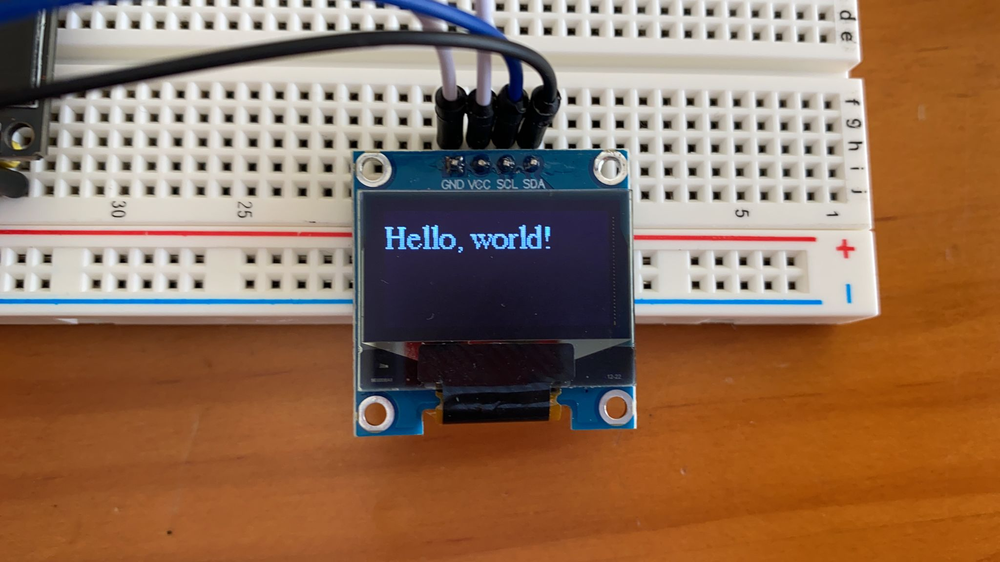
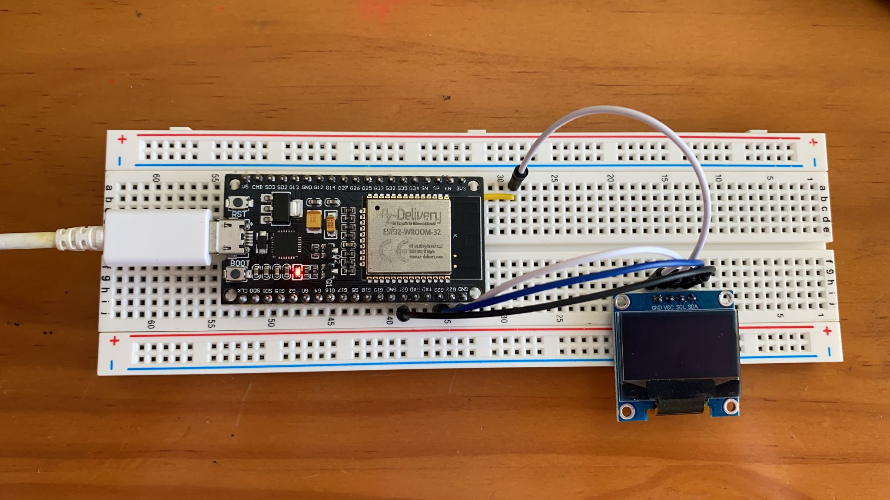

# PRACTICA 5
### PARTE 2:
Teniendo en cuenta que el componente no me a llegado, me e visto en la situacion de pedir ayuda a una compañera de clase especificamente Marta Enrich Garcia junto a la que el projecto y hemos realizado esta practica juntos por tal que la pudiese realizar, por ello las fotos mostradas son las mismas.
Siguiendo la programacion que se nos proporciona para realizar la practica podemos ver que la primera parte hacemos la definicion de las distintas librerias necesarias para su correcto funcionamiento seguido de la declaracion de un conjunto de 2 variables de distintos tipos los cuales son relacionados con las librerias definidas i que controlan la anchura y altura de la imagen que se mostrara en el display.
Seguidamente nos encontramos con el bloque del setup cuyo conjunto de comandos que hay en el empieza por como es comun en todos los programas un serial.begin a la misma velocidad del monitor_speed que se encuentra en el .ini, siguido a este encontramos un if el cual tiene como condicion que si detecta que el display no esta conectado nos mostrara por el terminal/monitor que la conexion con esta a fallado, de ser el caso contrario nos encontramos con un el comando          display.clearDisplay() el cual nos borrara todo lo que haya y dejara bacio todo el display que este conectado, seguidamente nos econtramos con varios comandos que configuran el display el primero de ellos es el que nos configura el tamaño del texto que se va a mostrar por él, el segundo de ellos es color del texto con el cual se va a mostrar y por ultimo en la posicion donde se va a mostrar en el display la frase que se ponga con el posterior comando que nos encontranmos el cual como he dicho anteriormente hace que se nos muestre la frase Hello, world! a traves del display en la posicion, con el tamaño y color indicados en la configuracion anterior. 
Todo lo de esta practica es observable a traves del display en el caso de que este no se encuentre bien conectado sera el unico caso donde observaremos algo a traves de la terminal/monitor, frase la cual nos informara que el componente no se encunetra bien conectado por tanto la conexion a fallado.
Fotos del montaje y lo observable a traves de ella:

